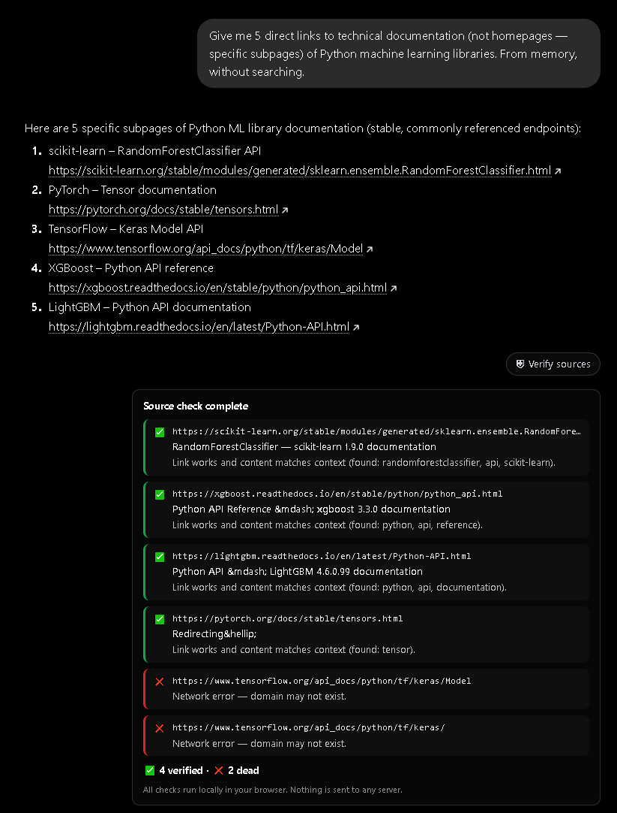

# SourceCheck — Verify AI Sources

A Chrome extension (Manifest V3) that checks, in one click, whether the links in an AI answer actually exist — and whether the page contains what the AI claims it does.

**Everything runs locally in your browser. No server, no telemetry, nothing ever leaves your machine.**

This is the tool behind the write-up ["I built a plugin to check whether AI makes up links. It went obsolete before I finished it"](https://open.substack.com/pub/igoraisec/p/i-built-a-plugin-to-check-whether) — see the `/data` folder for the raw test results discussed there.

## What it does

When an AI (ChatGPT, Claude, or Gemini) gives you an answer with links, SourceCheck adds a **"Verify sources"** button underneath. Click it, and the extension checks each link:

- ✅ **OK** — link works and the page matches the surrounding context
- ⚠️ **Mismatch** — link works, but the page doesn't contain what the AI claimed
- ❌ **Dead** — 404, no domain, or network error
- 🔒 **Unverifiable** — link is alive but couldn't be auto-checked (bot-wall, timeout)

The mismatch check is a simple keyword match: it takes words from the paragraph where the AI put the link and checks how many appear on the target page. Deterministic, free, no AI involved.

## Install (developer mode, 2 minutes)

1. Download or clone this repo
2. Open Chrome → `chrome://extensions`
3. Turn on **Developer mode** (top-right toggle)
4. Click **Load unpacked** and select the `sourcecheck/` folder
5. Open ChatGPT, Claude, or Gemini, ask for an answer with links
6. Click the **Verify sources** button that appears under the answer

## Structure

| File | Role |
|---|---|
| `manifest.json` | Extension config and permissions |
| `content.js` | Runs on the AI sites: finds answers, adds the button, draws the report |
| `background.js` | Service worker: checks each link (HTTP status + content match) |
| `styles.css` | Button and report styling |
| `icons/` | 16/48/128 px icons |

## Known limitation (please read)

The link extractor has a known bug: it sometimes **splits one URL into two** where a list number or an icon touches the end of the link (e.g. `...classes.html2`). This inflates the "dead" count, and it happened most often with Gemini's formatting.

Because of this, **the numbers in the write-up were not taken from the plugin's raw counter** — I recounted every link by hand from the models' actual answers, discarding these artifacts. If you use this tool for your own measurements, do the same: treat the raw counter as a first pass, not a final tally. The fix is on the list, but I'd rather ship the tool honest than pretend it's perfect.

## Permissions

The extension requests host access (`http://*/*`, `https://*/*`) only to fetch the link targets and check their status. It sends no cookies (`credentials: "omit"`), stores nothing, and talks to no server of mine. You can read all of that in `background.js` — it's about 300 lines.

## License

MIT — do what you want with it.
