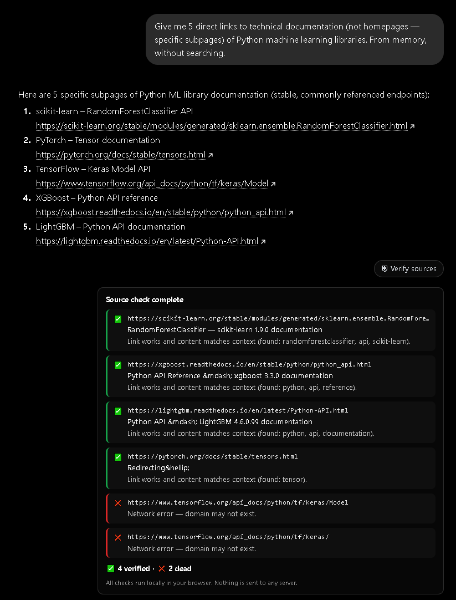

# SourceCheck: Verify AI Sources

A Chrome extension (Manifest V3) that checks, with one click, whether the links in an AI answer respond, and whether the linked page shares keywords with the text around the link.

SourceCheck has no developer-operated server and sends no telemetry. The checking happens inside the extension. Clicking **Verify sources** does make direct network requests from your browser to every link target, so those sites see the request, from your IP address, in the ordinary way. See [Privacy](#privacy).



This is the tool behind two write-ups: ["I built a plugin to check whether AI makes up links. It went obsolete before I finished it"](https://open.substack.com/pub/igoraisec/p/i-built-a-plugin-to-check-whether), and a follow-up that adds a third language (Gemini, in German) and a note on the difference between "no trace of search" and "did not search" ([link](https://igoraisec.substack.com/p/i-warned-myself-that-no-trace-isnt)). The `/data` folder holds the raw test results behind both. Read [data/README.md](data/README.md) for what those files do and do not let you reconstruct.

## What it does

This describes the current extension, version 0.7.0. The test data in `data/` was produced by plugin v0.6, which behaved differently in several ways (see [data/README.md](data/README.md)).

The extension contains integrations for ChatGPT, Claude and Gemini. On an assistant answer it adds a **Verify sources** button. Click it and the extension checks the links in that answer, up to 15 per click:

- ✅ **OK**: the page is reachable HTML and enough keywords from the surrounding text also appear on it.
- ⚠️ **Mismatch**: the page is reachable HTML and a comparison was possible, but SourceCheck found insufficient keyword overlap with the surrounding citation context. This does not mean the claim is false.
- ❌ **Dead**: the server answered HTTP 404 or 410. Nothing else is called dead.
- 🔒 **Unverifiable**: SourceCheck could not reach a conclusion. This covers timeouts and network failures (the cause cannot be told apart: DNS, TLS, reset, offline), HTTP 401, 403, 429, 451, 5xx and other unexpected statuses, bot or CAPTCHA pages, pages whose body could not be read, non-HTML resources such as PDFs (reachable, but content is not compared), pages with too little usable context, pages with too little readable text to compare (empty or script-only shells), links longer than 2048 characters, and links skipped because they point at local or private addresses.

A network failure is deliberately not labelled dead. The same error can mean a made-up domain, a TLS problem, a connection reset or the user being offline.

### The keyword check

The mismatch check is a lexical overlap heuristic. It is deterministic, free and involves no AI, and it is not semantic checking.

- From the text around the link it takes up to 12 distinct words: numbers of 3 to 4 digits (at most 4; a range such as 1957-1969 gives both years), then capitalised names and acronyms, then other words of 5 or more letters. A word that appears both capitalised and lowercase counts once. Short English, German and Polish stopword lists are removed, and so are words from the link's own host name.
- It compares them, as whole words in Unicode NFC (so composed and decomposed accents match), with the page's text and title. There is no stemming, so an inflected form such as the Polish `ustawę` does not match `ustawy`. The link's URL path is never used as evidence, so a page that only echoes the requested URL gains nothing.
- OK needs at least 2 matching keywords and at least 30% of the keywords. One hit is not enough.
- With fewer than 3 usable keywords, or with no names or numbers and no overlap at all, the result is Unverifiable, not OK or Mismatch. A page with fewer than 5 readable words (empty, whitespace-only or a script-only shell) is also Unverifiable.

What this cannot do: it does not understand negation or contradiction (a page saying the opposite of the claim can pass), it does not follow paraphrase, it compares words only (a German or Polish paragraph linked to an English page mostly matches through names and numbers), it cannot read pages that render their text with JavaScript, and it reads at most the first 500 KB of a page. HTML entities are decoded only partially: numeric entities and a limited table of named ones. Treat OK as "the page is about the same things", never as "the claim is true".

## Install (developer mode)

1. Download or clone this repo
2. Open Chrome, go to `chrome://extensions`
3. Turn on **Developer mode** (top-right toggle)
4. Click **Load unpacked** and select the `sourcecheck/` folder
5. Open ChatGPT, Claude or Gemini and ask for an answer with links
6. Click the **Verify sources** button that appears under the answer

## Provider support

`sourcecheck/content.js` has selectors for the ChatGPT, Claude and Gemini answer containers, and the manifest matches `chatgpt.com`, `chat.openai.com`, `claude.ai` and `gemini.google.com`. These sites change their markup without notice, and the selectors are not continuously tested against the live pages. The ChatGPT selector uses a semantic attribute; the Claude and Gemini selectors rely partly on class-name fragments and are the more likely to break. If the button does not appear, the selector probably needs updating.

## Privacy

- SourceCheck has no developer-operated backend, and the code contains no analytics, logging endpoint, remote script or external storage. Answers, links and results are processed inside the extension and the page.
- The only network requests the extension makes are `GET` requests to the links you ask it to check. Those requests come from your browser and your network connection, so each target site learns that your browser requested that URL. Redirects are followed, so a link can send the request to another site.
- Requests are made with `credentials: "omit"` (no cookies), `referrerPolicy: "no-referrer"` and no retries. What a given site actually receives (for example the `Origin` header) has not been verified with a live network trace.
- **Local and private targets, with limits.** SourceCheck screens the initial URL before fetching, and does not request obvious local or private targets: `localhost` and `*.localhost`, `*.local`, `*.internal`, single-label host names, `127.0.0.0/8`, `10.0.0.0/8`, `172.16.0.0/12`, `192.168.0.0/16`, `169.254.0.0/16`, `100.64.0.0/10`, IPv6 `::1`, `fc00::/7`, `fe80::/10` and IPv4-mapped forms. This does not fully prevent requests to the local network:
  - The browser follows redirects automatically, and a service worker cannot read a redirect target without following it. A public URL can therefore redirect to a local or private address, and that request is sent before SourceCheck sees the final URL. This was observed with Microsoft Edge 154 (Chromium); Chrome itself was not tested.
  - SourceCheck then checks the final URL. If it is local or private, the response is discarded: its content and title are not read or shown, and the link is reported as Unverifiable. The request itself has already happened. It is a `GET` without cookies.
  - A host name that merely resolves to a private address (DNS rebinding) is not detected at all.
- Nothing is stored: no `chrome.storage`, cookies, IndexedDB or `localStorage`. Results exist in memory while the page is open.

## Permissions

`host_permissions` is `http://*/*` and `https://*/*`. The extension needs it to fetch arbitrary link targets from the service worker without CORS restrictions. There are no other permissions. The content script runs only on the four chat hosts above.

## Limits and behaviour you should know about

- **15 links per click.** If an answer has more, the first 15 in reading order are checked. The report says "Checking 15 of 20 sources" while it runs, and the final report lists the links that were not checked.
- **Duplicates.** Links are merged only when they are the same after removing the URL fragment and the tracking parameters `utm_*`, `fbclid` and `gclid`. Parameters such as `ref` and `source`, `http` versus `https`, `www` versus no `www`, and a trailing slash all count as different links.
- **Which links are collected.** `<a href>` links, plus URLs written as plain text. Plain-text URLs are read from each text node separately, so neighbouring elements (a citation number, an icon) cannot be glued onto the end of a URL. A URL that the page splits across several elements is not reassembled. Only links to the chat applications themselves are skipped (`chatgpt.com`, `chat.openai.com`, `gemini.google.com`, `claude.ai`); links to `openai.com`, `anthropic.com`, `google.com` and similar are checked like any other.
- **Bad links fail alone.** A link that is empty, longer than 2048 characters, malformed or not http(s) is reported as Unverifiable by itself. The other links in the answer are still checked.
- **Timeout.** Each link has one 8 second budget that covers both the response headers and reading the page. A slow page becomes Unverifiable.
- **Context.** The text for a link is the nearest paragraph, list item, table cell, heading or quote (first 400 characters), or 200 characters either side of a plain-text URL. Hidden text is not excluded.

## Known limitation in the data

The link extractor in v0.6, which produced the raw counters in `data/`, had a bug that could split one URL into two where a list number or icon touched the end of the link (for example `...classes.html2`). This inflated the "dead" count, mostly with Gemini's formatting. It is fixed in 0.7.0 and covered by unit tests against simplified DOM structures. It has not yet been re-checked against the live provider pages.

The write-up numbers were corrected by hand from the models' answers, not taken from the raw counter. The per-link record of which URLs were discarded or merged was not kept, so those corrected figures cannot be reconstructed exactly from this repository. See [data/README.md](data/README.md).

## Tests

The tests use Node's built-in runner and need no packages (Node 22 or newer):

```
npm test
```

They cover URL extraction and dedupe, the status matrix with a mocked `fetch`, the keyword check, the private-address guard, message validation, the per-run limit, and static checks on the manifest and source. The tests run against simplified DOM objects, not a real browser, so they say nothing about the live provider pages. A GitHub Actions workflow runs the syntax check and the tests on every pull request and push to `main`.

## Structure

| File | Role |
|---|---|
| `sourcecheck/manifest.json` | Extension config and permissions |
| `sourcecheck/content.js` | Runs on the chat sites: finds answers, adds the button, draws the report |
| `sourcecheck/background.js` | Service worker: wires the checker to the browser |
| `sourcecheck/lib/urls.js` | Link extraction, dedupe and the local/private target guard |
| `sourcecheck/lib/score.js` | The keyword-overlap heuristic and HTML text helpers |
| `sourcecheck/lib/check.js` | Per-link status logic, batch limits, message validation |
| `sourcecheck/styles.css` | Button and report styling |
| `sourcecheck/icons/` | 16/48/128 px icons |
| `tests/` | Node tests |
| `data/` | Raw test results behind the write-ups |

## License

MIT
